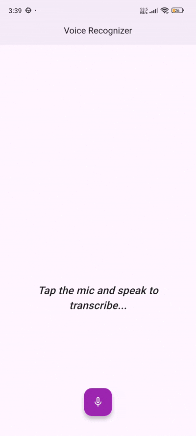

# flutter_speech_to_text_library

[](https://flutter.dev)
[](https://opensource.org/licenses/MIT)
[](#)

**flutter_speech_to_text_library** is a premium, high-performance Speech-to-Text library for Flutter. Engineered for smooth and responsive voice transcription, it features an elegant user interface equipped with active listening glow animations, natural text rendering, and intuitive callbacks.

---

## 📷 Preview

<p align="center">
  
</p>

*An interactive, premium-grade voice recognizer component featuring a speech-triggered avatar glow effect, live text rendering, and customizable themes.*

---
    
## ✨ Features

- **🎙️ Real-time Speech Recognition**
  - Instant speech-to-text transcription powered by the robust `speech_to_text` engine.
  - Efficient, low-latency recording capabilities that process words in real time.
- **🌟 Animated Avatar Glow**
  - Features a smooth, modern pulse animation (`avatar_glow`) to give users immediate visual feedback while the mic is active.
- **🎨 Custom Styling & Theme Integration**
  - Fully customizable design tokens including floating action button background, icon colors, pulse/glow colors, and text styles.
- **⚙️ Flexible Layout Integration**
  - Can be embedded directly as a sub-widget in custom column layouts (`useScaffold: false`) or launched as a standalone fullscreen screen layout (`useScaffold: true`).
- **🎯 Reactive State Callbacks**
  - Immediate transcription callbacks on text updates, alongside separate listener toggles to observe recording states natively.

---

## 📦 Installation

To use this library in your Flutter project, add it to your `pubspec.yaml` dependencies:

```yaml
dependencies:
  flutter:
    sdk: flutter
  flutter_speech_to_text_library:
    path: E:/Flutter_Codes/libraries/speechtotext/flutter_speech_to_text_library
```

*Note: Update the relative path where your library is located.*

---

## 🚀 Usage

Import the package in your Dart code:

```dart
import 'package:flutter_speech_to_text_library/flutter_speech_to_text_library.dart';
```

### 1. Embedded inside a Custom Layout

You can embed the component directly as a sub-widget by setting `useScaffold: false`.

```dart
class VoiceSearchScreen extends StatelessWidget {
  const VoiceSearchScreen({super.key});

  @override
  Widget build(BuildContext context) {
    return Scaffold(
      appBar: AppBar(
        title: const Text('Search by Voice'),
      ),
      body: Column(
        children: [
          const Padding(
            padding: EdgeInsets.all(16.0),
            child: Text(
              "Speak to look up items in our database",
              style: TextStyle(fontSize: 18, fontWeight: FontWeight.bold),
            ),
          ),
          Expanded(
            child: SimpleSpeechToTextWidget(
              useScaffold: false,
              placeholderText: 'Tap the mic and speak...',
              glowColor: Colors.deepPurpleAccent,
              buttonColor: Colors.deepPurple,
              iconColor: Colors.white,
              textStyle: const TextStyle(
                fontSize: 24.0,
                color: Colors.black87,
              ),
              onResult: (String text) {
                // Do something with the transcribed text
                print("Live Search query: $text");
              },
            ),
          ),
        ],
      ),
    );
  }
}
```

### 2. Standalone Fullscreen Mode

To use the widget as a pre-packaged fullscreen speech recognizer, set `useScaffold: true` (which is the default).

```dart
void openSpeechModal(BuildContext context) {
  Navigator.of(context).push(
    MaterialPageRoute(
      builder: (context) => SimpleSpeechToTextWidget(
        useScaffold: true,
        placeholderText: 'Listening to your command...',
        glowColor: Colors.purpleAccent,
        buttonColor: Colors.purple,
        iconColor: Colors.white,
        onResult: (String words) {
          print("Recognized words: $words");
        },
        onListeningStateChanged: (bool isListening) {
          print("Recording active: $isListening");
        },
      ),
    ),
  );
}
```

---

## 🛠️ API Reference

### `SimpleSpeechToTextWidget`

| Property | Type | Default | Description |
|---|---|---|---|
| `onResult` | `void Function(String)` | *Required* | Callback triggered each time new words are recognized and transcribed. |
| `onListeningStateChanged` | `void Function(bool)?` | `null` | Callback triggered whenever the microphone starts or stops listening. |
| `placeholderText` | `String` | `'Press the button and start speaking'` | The text displayed in the widget before speech transcription begins. |
| `glowColor` | `Color?` | `Theme.of(context).colorScheme.primary` | The color of the pulse/glow effect when active. |
| `buttonColor` | `Color?` | `null` | The background color of the microphone floating action button. |
| `iconColor` | `Color?` | `null` | The color of the mic icon inside the button. |
| `textStyle` | `TextStyle?` | *Theme Default* | The text style applied to the rendered transcribed text. |
| `useScaffold` | `bool` | `true` | When true, wraps the widget in a `Scaffold` and `SafeArea`. Set to `false` if nesting inside another widget structure. |
| `backgroundColor` | `Color?` | `null` | The background color of the widget (or the Scaffold body if `useScaffold` is true). Defaults to the theme's Scaffold background color. |

---

## 📄 License

```lic
MIT License

Copyright (c) 2026 Excelsior Technologies

Permission is hereby granted, free of charge, to any person obtaining a copy
of this software and associated documentation files (the "Software"), to deal
in the Software without restriction, including without limitation the rights
to use, copy, modify, merge, publish, distribute, sublicense, and/or sell
copies of the Software, and to permit persons to whom the Software is
furnished to do so, subject to the following conditions:

The above copyright notice and this permission notice shall be included in all
copies or substantial portions of the Software.

THE SOFTWARE IS PROVIDED "AS IS", WITHOUT WARRANTY OF ANY KIND, EXPRESS OR
IMPLIED, INCLUDING BUT NOT LIMITED TO THE WARRANTIES OF MERCHANTABILITY,
FITNESS FOR A PARTICULAR PURPOSE AND NONINFRINGEMENT. IN NO EVENT SHALL THE
AUTHORS OR COPYRIGHT HOLDERS BE LIABLE FOR ANY CLAIM, DAMAGES OR OTHER
LIABILITY, WHETHER IN AN ACTION OF CONTRACT, TORT OR OTHERWISE, ARISING FROM,
OUT OF OR IN CONNECTION WITH THE SOFTWARE OR THE USE OR OTHER DEALINGS IN THE
SOFTWARE.
```
